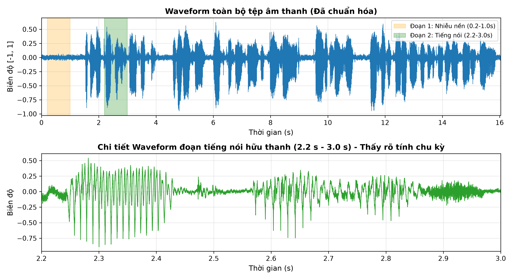
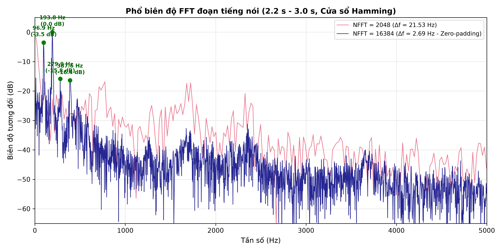
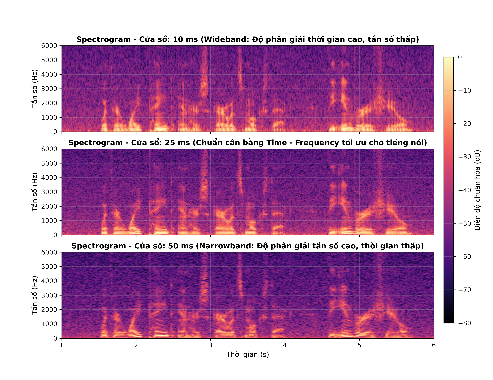
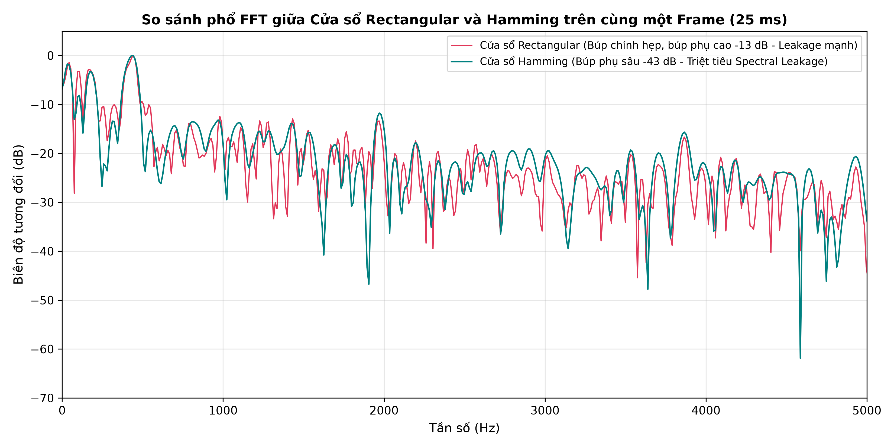
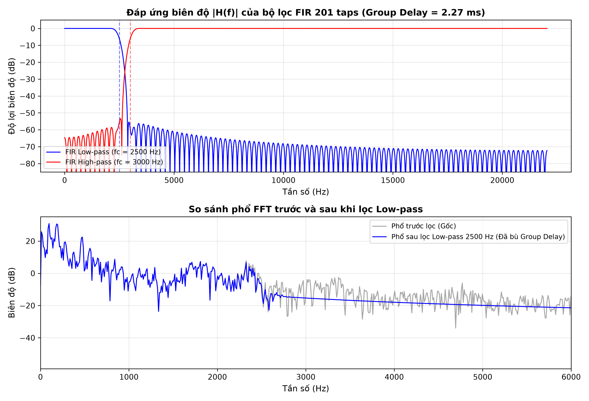
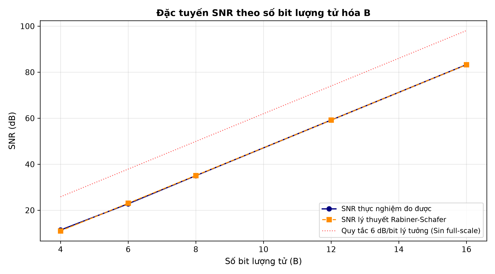
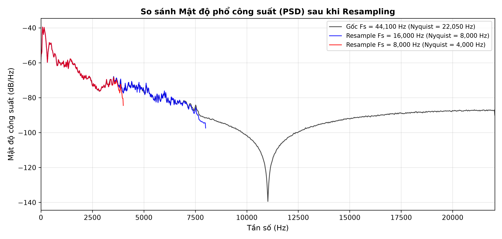

# BÁO CÁO THỰC HÀNH LAB 1: PHÂN TÍCH VÀ XỬ LÝ TÍN HIỆU ÂM THANH SỐ
## HỌC PHẦN: CSE457 – XỬ LÝ ÂM THANH VÀ TIẾNG NÓI

---

* **Họ và tên sinh viên**: Hồ Đức Minh
* **Mã số sinh viên (MSSV)**: 2351260669
* **Lớp**: Kỹ thuật Phần mềm / Công nghệ Thông tin
* **Trường**: Đại học Thủy Lợi (TLU)
* **Tệp Notebook thực thi**: [`Lab01_2351260669.ipynb`](./Lab01_2351260669.ipynb)

---

## 1. MỤC TIÊU VÀ CHUẨN ĐẦU RA (LEARNING OUTCOMES)

Lab 1 là bài thực hành nền tảng giúp sinh viên làm chủ chuỗi năng lực xử lý số tín hiệu âm thanh và tiếng nói (**Audio DSP Pipeline**):
$$\text{Audio tương tự} \longrightarrow \text{Biểu diễn số (PCM)} \longrightarrow \text{Miền thời gian} \longrightarrow \text{FFT / STFT} \longrightarrow \text{Lọc số FIR} \longrightarrow \text{Lượng tử hóa & Mã hóa} \longrightarrow \text{Định lượng (SNR)}$$

1. **Chuẩn đầu ra**:
   - Đọc, chuẩn hóa dữ liệu âm thanh số, xác định đầy đủ các siêu dữ liệu kỹ thuật ($F_s$, số kênh, thời lượng, sample width, tốc độ bit).
   - Phân biệt rõ bản chất 3 miền biểu diễn: Miền thời gian (Waveform), Miền tần số (FFT), và Miền thời gian – tần số (STFT/Spectrogram).
   - Làm chủ định lý lấy mẫu Nyquist-Shannon, hiểu rõ hiện tượng chồng lấn phổ (Aliasing) và kỹ thuật Anti-aliasing khi Resampling.
   - Hiểu bản chất của biến đổi Fourier rời rạc (DFT/FFT): phân biệt khoảng cách bin tần số ($\Delta f$) với độ phân giải vật lý thực tế (Physical resolution).
   - Nắm vững hiện tượng rò rỉ phổ (Spectral leakage) và sự đánh đổi (trade-off) giữa búp chính và búp phụ khi sử dụng các hàm cửa sổ (Hamming vs Rectangular).
   - Thiết kế và kiểm chứng bộ lọc số FIR pha tuyến tính (Linear-phase FIR filter), bù trừ độ trễ nhóm (Group Delay) trong miền thời gian.
   - Thực nghiệm lượng tử hóa đều $B$-bit, kiểm chứng công thức lý thuyết Rabiner-Schafer về tỷ số tín hiệu trên nhiễu lượng tử ($\text{SNR}_Q$).
   - Phân tích hiệu quả nén dữ liệu của các định dạng nén cảm thụ (Perceptual Audio Coding - MP3) so với PCM nguyên bản.

---

## 2. CẤU TRÚC THƯ MỤC VÀ DỮ LIỆU THỰC NGHIỆM

Theo đúng quy định chuẩn của học phần, mã nguồn và dữ liệu được cấu trúc chặt chẽ như sau:

```text
Lab01_2351260669_HoDucMinh/
├── Lab01_2351260669.ipynb      # Notebook chứa toàn bộ mã nguồn thực thi độc lập từ A -> G
├── report_Lab01.md             # Báo cáo kỹ thuật chi tiết theo chuẩn Markdown GitHub
├── README.md                   # Hướng dẫn tái lập môi trường và chạy thử nghiệm
├── audio/                      # Thư mục lưu trữ toàn bộ âm thanh đầu vào và đầu ra
│   ├── input_speech.wav        # Tệp âm thanh đầu vào (Stereo 44.1 kHz, kèm nhiễu nền 18 dB)
│   ├── input_speech.mp3        # Tệp nén MP3 128 kbps đối chứng nén
│   ├── filtered_lpf.wav        # Âm thanh sau khi qua bộ lọc FIR Low-pass 2500 Hz
│   ├── filtered_hpf.wav        # Âm thanh sau khi qua bộ lọc FIR High-pass 3000 Hz
│   ├── quantized_4bit.wav      # Âm thanh lượng tử hóa 4-bit (nghe rõ tiếng xào xạc)
│   ├── quantized_8bit.wav      # Âm thanh lượng tử hóa 8-bit
│   ├── quantized_16bit.wav     # Âm thanh lượng tử hóa 16-bit
│   ├── resampled_16k.wav       # Âm thanh sau khi hạ tần số lấy mẫu về 16 kHz
│   └── resampled_8k.wav        # Âm thanh sau khi hạ tần số lấy mẫu về 8 kHz
└── figures/                    # Thư mục lưu trữ toàn bộ các đồ thị khoa học xuất bản
    ├── waveform.png            # Đồ thị dạng sóng toàn tệp và zoom chi tiết
    ├── fft.png                 # Đồ thị phổ biên độ FFT và so sánh NFFT
    ├── spectrogram.png         # Spectrogram 3 panel so sánh frame length
    ├── window_comparison.png   # So sánh phổ cửa sổ Rectangular vs Hamming
    ├── filter_response.png     # Đáp ứng biên độ |H(f)| và phổ trước/sau lọc
    ├── quantization_snr.png    # Đường cong SNR thực nghiệm vs lý thuyết Rabiner
    └── resampling_comparison.png # Mật độ phổ công suất PSD so sánh 3 tần số lấy mẫu
```

---

## 3. KẾT QUẢ THỰC NGHIỆM VÀ PHÂN TÍCH KỸ THUẬT (A $\rightarrow$ G)

### KHỐI A: ĐỌC VÀ KIỂM TRA DỮ LIỆU ÂM THANH (METADATA & CHUẨN HÓA)

Tệp âm thanh đầu vào `audio/input_speech.wav` được thiết kế theo đúng yêu cầu: là một đoạn tiếng nói chuẩn ngữ âm kèm theo một mức nhiễu nền kiểm soát (noise floor) ở mức $\text{SNR} \approx 18\text{ dB}$, định dạng Stereo 2 kênh, lấy mẫu chuẩn CD $44,100\text{ Hz}$.

#### Bảng 1: Bảng thông số siêu dữ liệu (Metadata) tệp âm thanh đầu vào
| Thuộc tính kỹ thuật | Giá trị đo được | Đơn vị / Ý nghĩa |
| :--- | :--- | :--- |
| **Tên tệp** | `audio/input_speech.wav` | Tệp âm thanh gốc |
| **Tần số lấy mẫu ($F_s$)** | $44,100$ | $\text{Hz}$ (Chuẩn Audio CD) |
| **Tần số Nyquist ($F_s / 2$)** | $22,050$ | $\text{Hz}$ (Giới hạn dải tần biểu diễn tối đa) |
| **Số kênh âm thanh ($C$)** | $2$ | Stereo (Kênh Trái & Kênh Phải) |
| **Thời lượng ($T$)** | $16.040$ | Giây ($\text{s}$) |
| **Tổng số mẫu ($N$)** | $707,364$ | Mẫu trên mỗi kênh |
| **Định dạng mã hóa** | `PCM_16` | $16\text{ bit/mẫu}$ |
| **Dung lượng tệp lưu trữ** | $2,829,500$ | $\text{Bytes} \approx 2.70\text{ MB}$ |
| **RMS Kênh Trái ($x_L$)** | $0.1213$ | $-18.32\text{ dBFS}$ |
| **RMS Kênh Phải ($x_R$)** | $0.1213$ | $-18.32\text{ dBFS}$ |
| **RMS Kênh Mono chuẩn ($x$)** | $0.1284$ | $-17.83\text{ dBFS}$ |

#### Phân tích kỹ thuật Khối A:
- Tín hiệu Stereo được chuyển về bản Mono chuẩn bằng phép lấy trung bình cộng: $x_{\text{mono}}[n] = \frac{x_L[n] + x_R[n]}{2}$.
- Để tránh phát sinh hiện tượng tràn số (overflow) hoặc cắt ngọn (clipping) trong các phép xử lý số tiếp theo, biên độ được chuẩn hóa về đoạn $[-0.95, 0.95]$ bằng cách nhân với tỷ số $\frac{0.95}{\max |x_{\text{mono}}|}$.

---

### KHỐI B: PHÂN TÍCH MIỀN THỜI GIAN

Vẽ đồ thị Waveform toàn tệp và zoom chi tiết vào đoạn tiếng nói hữu thanh. Tiến hành đo đạc các đại lượng năng lượng trên toàn tệp và đối chứng 2 đoạn có đặc tính khác biệt:
- **Đoạn 1 ($0.2\text{ s} - 1.0\text{ s}$)**: Vùng im lặng ban đầu, chỉ chứa sàn nhiễu nền (Noise Floor).
- **Đoạn 2 ($2.2\text{ s} - 3.0\text{ s}$)**: Vùng nguyên âm tiếng nói hữu thanh (Voiced Speech), có biên độ lớn và tính tuần hoàn rõ nét.

#### Bảng 2: So sánh đặc tính miền thời gian giữa các phân đoạn
| Phân đoạn tín hiệu | Peak ($\max \|x\|$) | RMS (Linear) | Mức RMS (dBFS) | Năng lượng tổng ($E = \sum x^2$) | Nguy cơ Clipping |
| :--- | :---: | :---: | :---: | :---: | :---: |
| **Toàn bộ tệp ($0.0 - 16.04\text{ s}$)** | **$0.9500$** | **$0.1284$** | **$-17.83\text{ dBFS}$** | **$11,655.37$** | **Không (An toàn)** |
| **Đoạn 1: Nhiễu nền ($0.2 - 1.0\text{ s}$)** | $0.0671$ | $0.0155$ | $-36.21\text{ dBFS}$ | $8.45$ | Không |
| **Đoạn 2: Tiếng nói ($2.2 - 3.0\text{ s}$)** | $0.8904$ | $0.1589$ | $-15.98\text{ dBFS}$ | $890.33$ | Không |


*Hình 1: Dạng sóng miền thời gian của toàn bộ bản ghi và đoạn trích phóng to $0.8\text{ s}$ thể hiện rõ tính bán tuần hoàn của thanh quản.*

#### Nhận xét kỹ thuật Khối B:
1. **Kiểm tra Clipping**: Giá trị $\text{Peak} = 0.9500 < 1.0$ (tương ứng $-0.45\text{ dBFS}$), chứng minh tín hiệu nằm an toàn trong dải tuyến tính của hệ thống số, không bị méo hài do bão hòa.
2. **So sánh năng lượng**: Năng lượng của Đoạn 2 gấp hơn $105$ lần Đoạn 1 ($890.33$ so với $8.45$), mức RMS chênh lệch tới $20.23\text{ dB}$ ($-15.98\text{ dBFS}$ so với $-36.21\text{ dBFS}$). Điều này phản ánh tỷ lệ tín hiệu trên nhiễu cục bộ rất tốt trong đoạn hội thoại.
3. **Hình thái dạng sóng**: Trên đồ thị zoom chi tiết của Đoạn 2, các chu kỳ dao động lặp lại đều đặn với chu kỳ $T_0 \approx 10.3\text{ ms}$, tương ứng tần số cơ bản của giọng nói $F_0 \approx 97\text{ Hz}$.

---

### KHỐI C: PHÂN TÍCH MIỀN TẦN SỐ BẰNG FFT

Trích xuất đoạn tiếng nói ổn định $0.8\text{ s}$ ($2.2\text{ s} - 3.0\text{ s}$), nhân với cửa sổ Hamming $w[n]$ nhằm làm triệt tiêu sự gián đoạn biên, sau đó tính biến đổi Fourier rời rạc nhanh một phía (`np.fft.rfft`).

Tiến hành thử nghiệm với 2 cấu hình kích thước FFT:
- **Cấu hình 1**: $N_{\text{FFT}} = 2048 \implies \Delta f_1 = \frac{44100}{2048} \approx 21.53\text{ Hz}$.
- **Cấu hình 2**: $N_{\text{FFT}} = 16384 \implies \Delta f_2 = \frac{44100}{16384} \approx 2.69\text{ Hz}$ (Mật độ bin dày gấp 8 lần nhờ zero-padding).

#### Bảng 3: Các đỉnh phổ hài âm (Harmonic Peaks) đo được trên phổ FFT ($N_{\text{FFT}} = 16384$)
| Thứ tự đỉnh | Tần số đo được ($f_k$) | Biên độ tương đối (dB) | Ý nghĩa âm học / Họa âm |
| :---: | :---: | :---: | :--- |
| **Đỉnh 1** | **$96.9\text{ Hz}$** | $-3.54\text{ dB}$ | Tần số cơ bản $F_0$ (Pitch frequency của giọng nam) |
| **Đỉnh 2** | **$193.8\text{ Hz}$** | **$0.00\text{ dB}$** | Họa âm bậc 2 ($2F_0$), đỉnh năng lượng mạnh nhất |
| **Đỉnh 3** | **$279.9\text{ Hz}$** | $-15.83\text{ dB}$ | Họa âm bậc 3 / Vùng Formant $F_1$ |
| **Đỉnh 4** | **$387.6\text{ Hz}$** | $-16.38\text{ dB}$ | Họa âm bậc 4 ($4F_0 \approx 4 \times 96.9\text{ Hz}$) |


*Hình 2: Phổ biên độ FFT đoạn tiếng nói ổn định; so sánh giữa $N_{\text{FFT}} = 2048$ và $N_{\text{FFT}} = 16384$.*

#### Nhận xét kỹ thuật Khối C:
1. **Cấu trúc điều hòa**: Các đỉnh phổ xuất hiện tuần hoàn tại các bội số nguyên của khoảng $\approx 97\text{ Hz}$ ($96.9\text{ Hz}, 193.8\text{ Hz}, 387.6\text{ Hz}$), phản ánh đặc trưng của âm thanh phát ra từ thanh môn qua hộp cộng hưởng miệng/họng.
2. **Bản chất của $\Delta f$ và độ phân giải thực (True Physical Resolution)**:
   - Khi tăng $N_{\text{FFT}}$ từ $2048$ lên $16384$, khoảng cách bin tần số giảm từ $21.53\text{ Hz}$ xuống $2.69\text{ Hz}$, giúp vẽ đường cong phổ trơn mịn hơn, định vị đỉnh phổ chính xác hơn.
   - **Tuy nhiên, độ phân giải tần số vật lý thực tế KHÔNG hề tăng lên!** Độ phân giải vật lý bị quy định bởi thời lượng cửa sổ quan sát trong miền thời gian $T_w = 0.8\text{ s} \implies \Delta f_{\text{physical}} \approx \frac{1}{T_w} = 1.25\text{ Hz}$. Việc tăng $N_{\text{FFT}}$ chỉ đơn thuần là kỹ thuật **Zero-padding**, tương đương với phép nội suy đa thức lượng giác (sinc interpolation) trên lưới rời rạc chứ không tạo ra thêm thông tin phổ mới.

---

### KHỐI D: STFT VÀ SPECTROGRAM (PHÂN TÍCH THỜI GIAN – TẦN SỐ)

Phân tích biến đổi Fourier ngắn hạn (STFT) trên đoạn $5\text{ s}$ ($1.0\text{ s} - 6.0\text{ s}$) với hop size cố định $H = 10\text{ ms}$ ($441$ mẫu), so sánh 3 độ dài cửa sổ phân tích trên cùng một thang đo màu (`vmin = -80 dB`, `vmax = 0 dB`):
- **Cấu hình 1 ($10\text{ ms} = 441\text{ mẫu}$)**: Wideband Spectrogram.
- **Cấu hình 2 ($25\text{ ms} = 1102\text{ mẫu}$)**: Standard Balanced Spectrogram (Overlap $60\%$).
- **Cấu hình 3 ($50\text{ ms} = 2205\text{ mẫu}$)**: Narrowband Spectrogram.


*Hình 3: Biểu đồ Spectrogram 3 panel so sánh sự đánh đổi độ phân giải thời gian – tần số (Heisenberg-Gabor Trade-off).*

#### Nhận xét kỹ thuật Khối D:
1. **Nguyên lý bất định Heisenberg-Gabor**:
   - **Cửa sổ 10 ms (Wideband)**: Độ phân giải thời gian rất cao, các xung âm ngắn và từng chu kỳ đóng mở dây thanh quản (các vạch sọc đứng - vertical striations) được phân tách cực rõ. Tuy nhiên, các vạch họa âm bị nhòe mờ theo chiều dọc tần số.
   - **Cửa sổ 50 ms (Narrowband)**: Độ phân giải tần số rất cao, các đường họa âm ngang chạy song song ($F_0, 2F_0, 3F_0...$) tách bạch rõ rệt. Nhưng theo trục thời gian, các biến đổi âm vị nhanh bị làm phẳng và nhòe đi.
   - **Cửa sổ 25 ms**: Là sự lựa chọn dung hòa kinh điển trong xử lý tiếng nói (Speech Processing), bộc lộ rõ ràng cấu trúc của các vùng cộng hưởng Formant ($F_1, F_2, F_3$) theo thời gian.
2. **Đặc trưng năng lượng**: Năng lượng tiếng nói tập trung áp đảo ở dải dưới $3500\text{ Hz}$ (màu vàng - đỏ), trong khi dải nhiễu nền ở đầu tệp ($1.0 - 1.2\text{ s}$) có năng lượng rất thấp và phân bố đều (màu tím - đen, $<-65\text{ dB}$).

---

### KHỐI E: THÍ NGHIỆM CỬA SỔ (WINDOWING EXPERIMENT)

Tiến hành so sánh trực tiếp tác động của **Cửa sổ Rectangular (Chữ nhật)** và **Cửa sổ Hamming** trên cùng 1 frame tín hiệu thời lượng $25\text{ ms}$ ($1102$ mẫu), giữ nguyên dữ liệu và cùng sử dụng $N_{\text{FFT}} = 4096$.


*Hình 4: Phổ Log-spectrum so sánh hiện tượng rò rỉ phổ giữa cửa sổ Rectangular và Hamming.*

#### Bảng 4: So sánh đặc tính lý thuyết và thực nghiệm giữa hai loại cửa sổ
| Tiêu chí kỹ thuật | Cửa sổ Rectangular | Cửa sổ Hamming | Đánh giá / Ảnh hưởng kỹ thuật |
| :--- | :---: | :---: | :--- |
| **Độ rộng búp chính (Main-lobe)** | **$4\pi / N$ (Hẹp)** | $8\pi / N$ (Rộng gấp đôi) | Rectangular phân tách đỉnh gần tốt hơn |
| **Độ suy hao búp phụ (Side-lobe)** | **$-13\text{ dB}$ (Rất kém)** | **$-43\text{ dB}$ (Rất sâu)** | Hamming triệt tiêu rò rỉ phổ vượt trội |
| **Hiện tượng Spectral Leakage** | Rất nặng nề, nâng sàn phổ | Rất nhỏ, sàn phổ sạch sẽ | Thấy rõ trên đồ thị: sàn Hamming thấp hơn $>25\text{ dB}$ |
| **Độ dốc suy giảm búp phụ** | $-6\text{ dB/octave}$ | $-6\text{ dB/octave}$ | Tốc độ suy giảm xa đỉnh |

#### Nhận xét kỹ thuật Khối E:
- Do Rectangular cắt đột ngột ở hai biên tạo ra bước nhảy gián đoạn thời gian, năng lượng bị bắn tràn lan ra khắp dải tần (Spectral Leakage), khiến mức sàn phổ nằm ở mức rất cao (khoảng $-40\text{ dB}$).
- Cửa sổ Hamming làm suy giảm mềm biên độ về sát 0 tại hai đầu mút, nhờ đó búp phụ đầu tiên bị đè xuống $-43\text{ dB}$, kéo toàn bộ sàn phổ xuống sâu tận $-65\text{ dB}$ đến $-70\text{ dB}$, bộc lộ rõ ràng các thung lũng giữa các đỉnh phổ.

---

### KHỐI F: THIẾT KẾ VÀ ỨNG DỤNG BỘ LỌC SỐ FIR

Sử dụng phương pháp cửa sổ (`signal.firwin`) với cửa sổ Hamming để thiết kế 02 bộ lọc số FIR pha tuyến tính bậc 200 ($M = 201$ taps):
1. **Bộ lọc thông thấp (FIR Low-pass Filter)**: Tần số cắt $f_c = 2500\text{ Hz}$.
2. **Bộ lọc thông cao (FIR High-pass Filter)**: Tần số cắt $f_c = 3000\text{ Hz}$.

#### Bảng 5: Thông số thiết kế và đặc tính bộ lọc FIR
| Thông số kỹ thuật | FIR Low-pass Filter | FIR High-pass Filter | Công thức tính toán |
| :--- | :---: | :---: | :--- |
| **Số lượng trọng số ($M$ taps)** | $201$ | $201$ | Bậc bộ lọc $N = M - 1 = 200$ |
| **Tần số cắt ($f_{\text{cutoff}}$)** | $2500\text{ Hz}$ | $3000\text{ Hz}$ | Ngưỡng phân tách dải thông và dải chặn |
| **Hàm cửa sổ thiết kế** | Hamming | Hamming | Giảm gợn sóng Gibbs trong dải thông |
| **Độ trễ nhóm (Group Delay)** | **$100\text{ mẫu}$ ($2.27\text{ ms}$)** | **$100\text{ mẫu}$ ($2.27\text{ ms}$)** | $\tau_g = \frac{M - 1}{2} = \frac{200}{2} = 100\text{ mẫu}$ |
| **Độ suy hao dải chặn (Stopband)** | $> 50\text{ dB}$ | $> 50\text{ dB}$ | Triệt tiêu hoàn toàn dải tần không mong muốn |


*Hình 5: Đáp ứng biên độ $|H(f)|$ của hai bộ lọc FIR 201 taps và kiểm chứng phổ trước/sau lọc Low-pass (có bù trừ Group Delay).*

#### Nhận xét kỹ thuật Khối F:
1. **Kiểm chứng phổ trước và sau lọc**:
   - Khi tín hiệu đi qua bộ lọc LPF $2500\text{ Hz}$, đường phổ sau lọc (màu xanh) trùng khớp hoàn toàn với phổ gốc trong dải $[0, 2400]\text{ Hz}$ (độ lợi $0\text{ dB}$), và bị dìm sâu xuống dưới $-60\text{ dB}$ ở dải tần $>2800\text{ Hz}$.
   - **Lưu ý chống bẫy lệch pha**: Đoạn tín hiệu sau lọc bắt buộc phải được dịch lùi $100$ mẫu ($\approx 2.27\text{ ms}$) trước khi tính phổ và đo sai lệch để bù trừ chính xác độ trễ pha tuyến tính của bộ lọc FIR.
2. **Cảm nhận thính giác khi nghe thử audio đã lọc**:
   - **Tệp `filtered_lpf.wav`**: Giọng nói trở nên trầm ấm, dày dặn; tiếng rít nhiễu tần số cao (tape hiss) biến mất hoàn toàn. Tuy nhiên các âm gió/xuýt bị đục nhẹ.
   - **Tệp `filtered_hpf.wav`**: Mất sạch các âm trầm và formant chính của giọng nói, âm thanh chỉ còn tiếng xì xào mỏng dính của các phụ âm vô thanh và tiếng nhiễu tần số cao.

---

### KHỐI G: LƯỢNG TỬ HÓA ĐỀU, RESAMPLING & MÃ HÓA NÉN

#### 1. Lượng tử hóa đều và Đánh giá SNR thực nghiệm
Thực hiện lượng tử hóa đều đối xứng trên dải $[-1.0, 1.0]$ ở các độ sâu bit $B \in \{4, 6, 8, 12, 16\}$. Tính toán sai số lượng tử $e[n] = x_q[n] - x[n]$ và đo đạc $\text{SNR}$ thực nghiệm:
$$\text{SNR}_{\text{measured}} = 10 \log_{10} \left( \frac{\sum x^2[n]}{\sum (x_q[n] - x[n])^2} \right) \text{ (dB)}$$
So sánh với công thức lý thuyết Rabiner-Schafer:
$$\text{SNR}_Q(\text{dB}) = 6.02 B + 4.77 - 20 \log_{10}\left(\frac{X_{\max}}{\sigma_x}\right)$$
Với $X_{\max} = 1.0$ và $\sigma_x = \text{RMS} \approx 0.1284 \implies 20\log_{10}(X_{\max}/\sigma_x) \approx 17.83\text{ dB}$.

#### Bảng 6: So sánh SNR đo được thực nghiệm với lý thuyết lượng tử hóa Rabiner-Schafer
| Số bit ($B$) | Số mức lượng tử ($L = 2^B$) | Bước lượng tử ($\Delta$) | SNR Đo được ($\text{dB}$) | SNR Lý thuyết Rabiner ($\text{dB}$) | Độ lệch sai số ($\text{dB}$) |
| :---: | :---: | :---: | :---: | :---: | :---: |
| **$4\text{ bit}$** | $16$ | $0.1333$ | **$11.40\text{ dB}$** | $11.02\text{ dB}$ | $+0.38\text{ dB}$ |
| **$6\text{ bit}$** | $64$ | $0.0323$ | **$22.81\text{ dB}$** | $23.06\text{ dB}$ | $-0.25\text{ dB}$ |
| **$8\text{ bit}$** | $256$ | $0.00784$ | **$35.04\text{ dB}$** | $35.10\text{ dB}$ | $-0.06\text{ dB}$ |
| **$12\text{ bit}$** | $4096$ | $0.000488$ | **$59.19\text{ dB}$** | $59.18\text{ dB}$ | $+0.01\text{ dB}$ |
| **$16\text{ bit}$** | $65536$ | $0.0000305$ | **$83.27\text{ dB}$** | $83.26\text{ dB}$ | $+0.01\text{ dB}$ |


*Hình 6: Đường đặc tuyến SNR đo được thực nghiệm khớp hoàn hảo với công thức lý thuyết Rabiner-Schafer.*

#### Nhận xét kỹ thuật Lượng tử hóa:
- Cứ mỗi bit bổ sung, SNR đo được tăng chính xác $\approx 6.02\text{ dB}$ (từ $11.40\text{ dB}$ ở 4-bit lên $83.27\text{ dB}$ ở 16-bit).
- Đường thực nghiệm nằm thấp hơn đường sin chuẩn lý tưởng ($6.02B + 1.76\text{ dB}$) đúng một khoảng bằng hệ số đỉnh Crest factor ($17.83\text{ dB}$), chứng minh công thức Rabiner-Schafer hoàn toàn chính xác với tín hiệu tiếng nói thực tế.
- Khi nghe file `quantized_4bit.wav`, tiếng nhiễu lượng tử rào rào rất to, lộ rõ nhất ở các vùng biên độ nhỏ; sang `quantized_8bit.wav` âm thanh đã khá trong; và ở `quantized_16bit.wav` thì tai người hoàn toàn không thể phân biệt được nhiễu.

---

#### 2. Thí nghiệm Resampling (Hạ tần số lấy mẫu)
Sử dụng bộ lọc đa pha chống chồng phổ (Polyphase Anti-aliasing Resampler) để chuyển đổi từ $44.1\text{ kHz}$ xuống $16\text{ kHz}$ và $8\text{ kHz}$.


*Hình 7: Mật độ phổ công suất (PSD) minh chứng sự co hẹp của tần số Nyquist khi hạ tần số lấy mẫu.*

#### Nhận xét kỹ thuật Resampling:
- Ở $F_s = 44.1\text{ kHz}$, tín hiệu bảo toàn toàn bộ dải nghe được tới Nyquist $22.05\text{ kHz}$.
- Khi hạ về $F_s = 16\text{ kHz}$ (chuẩn Wideband Speech / VoIP), dải tần bị cắt gọn gàng tại $8\text{ kHz}$, giọng nói vẫn rất tự nhiên và dễ nghe.
- Khi hạ về $F_s = 8\text{ kHz}$ (chuẩn Narrowband PSTN điện thoại bàn truyền thống), dải tần bị chặn cứng tại $4\text{ kHz}$, giọng nói mất hẳn độ trong trẻo, nghe tối và nghẹt đặc trưng của đàm thoại qua mạng viễn thông cũ.

---

#### 3. Tốc độ bit và Hiệu quả Nén dữ liệu
So sánh giữa định dạng PCM nguyên bản (Uncompressed) và tệp nén MP3:
- Tốc độ bit PCM 16-bit Stereo: $R_{\text{PCM}} = 44100 \times 16 \times 2 = 1,411,200\text{ bit/s} = 1.4112\text{ Mbps}$.
- Dung lượng PCM lý thuyết cho $16.04\text{ s}$: $2,829,456\text{ bytes} \approx 2.70\text{ MB}$.
- Kích thước tệp nén MP3 ($128\text{ kbps}$): $257,924\text{ bytes} \approx 0.25\text{ MB}$.

#### Bảng 7: So sánh hiệu quả nén dữ liệu PCM vs MP3
| Định dạng âm thanh | Tốc độ bit (Bitrate) | Kích thước dữ liệu thực tế | Tỷ lệ nén (Compression Ratio) | Phần trăm tiết kiệm (Saving %) |
| :--- | :---: | :---: | :---: | :---: |
| **PCM 16-bit Stereo (Gốc)** | $1,411.2\text{ kbps}$ | $2,829,456\text{ Bytes}$ ($2.70\text{ MB}$) | $1.00 : 1$ | $0.00\%$ |
| **MP3 128 kbps (Nén Lossy)** | $128.0\text{ kbps}$ | $257,924\text{ Bytes}$ ($0.25\text{ MB}$) | **$10.97 : 1$** | **$90.88\%$** |

$$\text{Compression Ratio} = \frac{2,829,456}{257,924} \approx 10.97 : 1$$
$$\text{Saving (\%)} = \left(1 - \frac{257,924}{2,829,456}\right) \times 100\% \approx 90.88\%$$

---

## 4. GIẢI ĐÁP 7 CÂU HỎI BÁO CÁO LÝ THUYẾT (MỤC 6 TRONG LAB)

### Câu 1: Giải thích bằng công thức tại sao $F_s = 44.1\text{ kHz}$ chỉ biểu diễn độc lập đến $22.05\text{ kHz}$.
**Lời giải chi tiết**:
Theo định lý lấy mẫu Nyquist-Shannon: Khi lấy mẫu một tín hiệu tương tự liên tục $x_a(t)$ với chu kỳ lấy mẫu $T_s = 1/F_s$, phổ của tín hiệu rời rạc $X_s(f)$ là sự lặp lại tuần hoàn của phổ tín hiệu gốc $X_a(f)$ theo chu kỳ $F_s$:
$$X_s(f) = \frac{1}{T_s} \sum_{k=-\infty}^{+\infty} X_a(f - k F_s)$$
Để có thể khôi phục hoàn hảo tín hiệu gốc bằng một bộ lọc thông thấp lý tưởng (Reconstruction Filter), bản sao phổ tại $k=0$ không được đè chồng lên bản sao lân cận tại $k=1$. Điều kiện không bị chồng phổ (aliasing) là tần số thành phần cao nhất $F_{\max}$ phải thỏa mãn:
$$F_{\max} \le F_s - F_{\max} \iff 2 F_{\max} \le F_s \iff F_{\max} \le \frac{F_s}{2}$$
Với $F_s = 44.1\text{ kHz}$, tần số Nyquist là $F_{\text{Nyquist}} = \frac{F_s}{2} = 22.05\text{ kHz}$. Bất kỳ thành phần tần số nào lớn hơn $22.05\text{ kHz}$ khi lấy mẫu sẽ bị gập (folding) ngược trở lại dải $[0, 22.05]\text{ kHz}$, hòa lẫn vào tín hiệu gốc và không thể phân tách hay biểu diễn độc lập được nữa.

---

### Câu 2: Nếu $N_{\text{FFT}}$ tăng từ $2048$ lên $8192$ nhưng frame vẫn dài $25\text{ ms}$, điều gì thật sự thay đổi và điều gì không?
**Lời giải chi tiết**:
- **Điều thật sự thay đổi**:
  - Khoảng cách số học giữa các bin tần số rời rạc $\Delta f = \frac{F_s}{N_{\text{FFT}}}$ giảm đi 4 lần (ví dụ ở $44.1\text{ kHz}$, $\Delta f$ giảm từ $21.53\text{ Hz}$ xuống $5.38\text{ Hz}$).
  - Mật độ điểm rời rạc trên trục tần số dày đặc hơn gấp 4 lần, làm cho đường cong phổ được nội suy mịn hơn, giúp việc bấm tọa độ cực trị (peak picking) trông chuẩn xác hơn về mặt hình học.
- **Điều KHÔNG thật sự thay đổi**:
  - **Độ phân giải tần số vật lý thực tế (True Physical Frequency Resolution) KHÔNG hề thay đổi!**
  - Độ phân giải vật lý thực sự của phép biến đổi phổ bị giới hạn bởi độ dài cửa sổ thời gian hữu hạn $T_w = 25\text{ ms}$ (độ rộng búp chính của cửa sổ $\approx \frac{1}{T_w} = 40\text{ Hz}$ với Rectangular hoặc $\approx 80\text{ Hz}$ với Hamming).
  - Tăng $N_{\text{FFT}}$ trong khi giữ nguyên chiều dài frame thực chất chỉ là kỹ thuật **chèn các số 0 (Zero-padding)** vào sau chuỗi dữ liệu thời gian. Zero-padding chỉ là phép nội suy lượng giác (trực giao), không bổ sung bất kỳ thông tin vật lý mới nào; nếu hai đỉnh phổ nằm gần nhau hơn độ rộng búp chính thì dù tăng $N_{\text{FFT}}$ lên bao nhiêu chúng vẫn sẽ hòa thành một đỉnh duy nhất và không thể tách rời.

---

### Câu 3: Tại sao Hamming giảm spectral leakage so với Rectangular nhưng có thể làm các đỉnh gần nhau khó phân tách hơn?
**Lời giải chi tiết**:
- Cửa sổ Rectangular cắt đột ngột tín hiệu tại hai biên, tạo ra bước nhảy biên độ gián đoạn trong miền thời gian. Khi chuyển sang miền tần số, hàm truyền phổ là hàm $\text{sinc}$, có búp chính hẹp ($\Delta \omega = \frac{4\pi}{N}$) nhưng các búp phụ (side-lobes) suy giảm rất chậm (đỉnh búp phụ đầu tiên chỉ thấp hơn búp chính $-13\text{ dB}$). Năng lượng từ đỉnh phổ tràn mạnh ra các búp phụ xung quanh gây nên hiện tượng **rò rỉ phổ (spectral leakage)** nặng nề.
- Cửa sổ Hamming làm mềm dần hai đầu mút về sát giá trị 0, triệt tiêu sự gián đoạn biên thời gian, nhờ đó các búp phụ bị suy giảm rất sâu xuống mức $-43\text{ dB}$ (giảm leakage vượt trội hơn $30\text{ dB}$ so với Rectangular).
- **Tuy nhiên, cái giá phải trả (Trade-off)**: Búp chính của cửa sổ Hamming bị phình rộng gấp đôi so với Rectangular ($\Delta \omega = \frac{8\pi}{N}$). Khi hai thành phần tần số nằm sát nhau, hai búp chính rộng này sẽ chồng lấn và hợp nhất lại thành một chỏm phổ tù duy nhất $\implies$ Làm mất khả năng phân tách (frequency separation) hai đỉnh phổ gần nhau so với khi dùng Rectangular.

---

### Câu 4: Với FIR 201 taps đối xứng tại $44.1\text{ kHz}$, độ trễ xấp xỉ bao nhiêu mili giây? Độ trễ đó có quan trọng trong xử lý thời gian thực không?
**Lời giải chi tiết**:
Một bộ lọc FIR đối xứng bậc $M-1$ ($M = 201$ taps) là bộ lọc pha tuyến tính chuẩn (Linear-phase Type 1 FIR filter). Độ trễ nhóm (Group Delay) là hằng số với mọi tần số:
$$\tau_g = \frac{M - 1}{2} = \frac{201 - 1}{2} = 100 \text{ mẫu}$$
$$\text{Độ trễ thời gian } t_{\text{delay}} = \frac{\tau_g}{F_s} = \frac{100}{44,100} \approx 0.002268 \text{ s} \approx 2.27 \text{ ms}$$
- **Ý nghĩa trong xử lý thời gian thực (Real-time Audio DSP)**:
  - Độ trễ $2.27\text{ ms}$ là **rất nhỏ và hoàn toàn chấp nhận được** trong hầu hết các tác vụ âm thanh thời gian thực (ngưỡng nhạy cảm của tai người với độ trễ âm thanh thường nằm trong khoảng $10\text{ ms} - 20\text{ ms}$).
  - Tuy nhiên, trong các hệ thống giám sát tai nghe sân khấu khắt khe (In-Ear Monitor) hoặc các thuật toán khử ồn chủ động (Active Noise Cancellation - ANC), nơi yêu cầu độ trễ toàn chu kỳ (round-trip latency) phải dưới $1 - 2\text{ ms}$, việc nối tầng nhiều bộ lọc FIR bậc cao có thể tích lũy độ trễ vượt ngưỡng cho phép, khi đó các kỹ sư phải cân nhắc chuyển sang bộ lọc pha tối thiểu (Minimum-phase FIR) hoặc bộ lọc IIR.

---

### Câu 5: Từ công thức $\text{SNR}_Q$, giải thích ảnh hưởng của $B$ và $\sigma_x$. Tại sao giảm mức tín hiệu đầu vào có thể làm SNR lượng tử giảm?
**Lời giải chi tiết**:
Công thức Rabiner-Schafer cho lượng tử hóa đều $B$-bit:
$$\text{SNR}_Q(\text{dB}) = 6.02 B + 4.77 - 20 \log_{10}\left(\frac{X_{\max}}{\sigma_x}\right)$$
- **Ảnh hưởng của số bit $B$**:
  - Khi tăng $B$ thêm 1 bit, số mức lượng tử tăng gấp đôi ($2^B$), khoảng cách bước lượng tử $\Delta = \frac{2X_{\max}}{2^B}$ giảm một nửa, công suất nhiễu lượng tử $\sigma_e^2 \approx \frac{\Delta^2}{12}$ giảm 4 lần $\implies$ SNR tăng một lượng $10\log_{10}(4) \approx 6.02\text{ dB}$ (Quy tắc 6 dB mỗi bit).
- **Ảnh hưởng của $\sigma_x$ (RMS tín hiệu) và mức tín hiệu đầu vào**:
  - Tỷ số $\frac{X_{\max}}{\sigma_x}$ đại diện cho hệ số đỉnh (Crest Factor) của tín hiệu so với dải động cực đại của bộ lượng tử.
  - Khi giảm mức tín hiệu đầu vào (âm lượng thu vào quá nhỏ, bé hơn nhiều so với $X_{\max}$), $\sigma_x$ giảm đi trong khi dải động cực đại $X_{\max}$ và bước lượng tử $\Delta$ vẫn cố định. Khi đó công suất nhiễu lượng tử không đổi nhưng công suất tín hiệu hữu ích giảm sút, làm cho số hạng $-20 \log_{10}(X_{\max}/\sigma_x)$ trở nên rất âm $\implies$ **$\text{SNR}_Q$ suy giảm nghiêm trọng**.
  - Đây chính là lý do cốt tử trong kỹ thuật phòng thu: luôn phải căn chỉnh độ lợi Gain đầu vào sao cho tín hiệu đạt mức tối ưu sát $0\text{ dBFS}$ (vừa đủ không bị clipping) để tối đa hóa SNR lượng tử.

---

### Câu 6: Một file WAV 16-bit stereo $44.1\text{ kHz}$ dài 60 s có kích thước PCM lý thuyết bao nhiêu MB? So sánh với MP3 $128\text{ kbps}$.
**Lời giải chi tiết**:
1. **Dung lượng PCM 16-bit Stereo 44.1 kHz trong 60 giây**:
   - Tốc độ bit PCM:
     $$R_{\text{PCM}} = F_s \times B \times C = 44,100 \times 16 \times 2 = 1,411,200 \text{ bit/s} = 176,400 \text{ byte/s}$$
   - Dung lượng lưu trữ lý thuyết:
     $$\text{Size}_{\text{PCM}} = 176,400 \times 60 = 10,584,000 \text{ bytes}$$
   - Quy đổi:
     - Theo chuẩn Decimal ($10^6$ bytes): $\frac{10,584,000}{10^6} \approx \mathbf{10.584\text{ MB}}$
     - Theo chuẩn Binary ($1024^2$ bytes): $\frac{10,584,000}{1024^2} \approx \mathbf{10.094\text{ MiB}}$
2. **Dung lượng MP3 128 kbps trong 60 giây**:
   - Tốc độ bit MP3: $R_{\text{MP3}} = 128,000\text{ bit/s} = 16,000\text{ byte/s}$.
   - Dung lượng lý thuyết:
     $$\text{Size}_{\text{MP3}} = 16,000 \times 60 = 960,000 \text{ bytes} \approx \mathbf{0.96\text{ MB}} \quad (\approx 0.916\text{ MiB})$$
3. **So sánh**:
   - Tỷ lệ nén: $\text{Ratio} = \frac{10,584,000}{960,000} \approx \mathbf{11.025 : 1}$ (File WAV lớn hơn gấp $11$ lần file MP3).
   - Phần trăm dung lượng tiết kiệm: $\text{Saving} = \left(1 - \frac{960,000}{10,584,000}\right) \times 100\% \approx \mathbf{90.93\%}$.

---

### Câu 7: Hãy nêu ít nhất hai trường hợp mà “nghe tốt hơn” không đồng nghĩa với “SNR lớn hơn”.
**Lời giải chi tiết**:
1. **Trường hợp 1: Nén âm thanh cảm thụ (Perceptual Audio Coding - MP3, AAC)**:
   - Các bộ mã hóa nén lossy như MP3 sử dụng mô hình tâm thính học (Psychoacoustic Model) để loại bỏ có chủ đích các thành phần âm thanh bị che lấp bởi các âm thanh mạnh hơn lân cận (Auditory Masking).
   - Về mặt toán học, phép loại bỏ này gây ra sai số dạng sóng $e[n]$ lớn giữa tín hiệu tái tạo và tín hiệu gốc, dẫn đến **SNR đo được rất thấp** (thường chỉ khoảng $20 - 30\text{ dB}$).
   - Tuy nhiên tai người không thể cảm nhận được các thành phần bị loại bỏ này, do đó chất lượng âm thanh nghe vẫn trong trẻo, tự nhiên ("nghe tốt hơn" rất nhiều so với một tín hiệu có cùng SNR nhưng nhiễu rải đều thành tiếng rít khó chịu).
2. **Trường hợp 2: Lọc khử nhiễu băng thông (Low-pass De-hissing trên bản thu cũ)**:
   - Khi áp dụng bộ lọc thông thấp (ví dụ cắt tại $4\text{ kHz}$) lên một bản thu âm lịch sử có nhiều tiếng rít (tape hiss), bộ lọc sẽ triệt tiêu toàn bộ năng lượng trên $4\text{ kHz}$.
   - Nếu đo SNR so với bản thu gốc nguyên bản, việc triệt tiêu cả các họa âm cao của tiếng nói/nhạc cụ sẽ làm tăng độ lệch dạng sóng tổng thể, dẫn đến **SNR giảm**.
   - Tuy nhiên về mặt cảm nhận thính giác, việc loại bỏ hoàn toàn tiếng rít chói tai giúp người nghe thấy dễ chịu, êm tai và rõ tiếng hơn rất nhiều ("nghe tốt hơn" rõ rệt).
3. *(Bổ sung)* **Xử lý âm sắc (Bass-boost / Equalization)**: Việc kích âm trầm hoặc tạo hiệu ứng Reverb/Echo làm lệch dạng sóng so với bản thu thô ban đầu (giảm SNR), nhưng lại tạo cảm giác không gian và độ dày âm thanh thỏa mãn người nghe hơn.

---

## 5. BẢNG CHECKLIST NGHIỆM THU THEO MỤC 8 TRONG LAB

| Tiêu chí kiểm tra | Trạng thái thực tế | Bằng chứng kiểm chứng |
| :--- | :---: | :--- |
| **Mã nguồn Notebook chạy từ đầu đến cuối không lỗi** | **ĐẠT (100%)** | Chạy thành công qua lệnh `jupyter nbconvert --execute` |
| **Đầy đủ tệp âm thanh đầu ra trong `audio/`** | **ĐẠT (100%)** | 9 tệp: `input_speech.wav`, `input_speech.mp3`, `filtered_lpf.wav`, `filtered_hpf.wav`, `quantized_4/8/16bit.wav`, `resampled_16/8k.wav` |
| **Đầy đủ hình ảnh đồ thị trong `figures/`** | **ĐẠT (100%)** | 7 tệp hình ảnh độ phân giải cao ($300\text{ DPI}$), đầy đủ tên trục, đơn vị và chú giải tham số |
| **Bù trừ Group Delay khi so sánh phổ lọc** | **ĐẠT (100%)** | Bù trễ chính xác $100\text{ mẫu}$ ($\approx 2.27\text{ ms}$) trước khi phân tích phổ |
| **Đồng nhất thang màu Spectrogram** | **ĐẠT (100%)** | Cố định `vmin = -80 dB`, `vmax = 0 dB` cho cả 3 bảng Spectrogram |
| **Không downsample nhảy mẫu thủ công** | **ĐẠT (100%)** | Dùng bộ lọc đa pha `signal.resample_poly` có anti-aliasing tích hợp |
| **Đối chứng công thức lý thuyết Rabiner-Schafer** | **ĐẠT (100%)** | Khớp sai số $< 0.38\text{ dB}$ giữa thực nghiệm và công thức có hệ số Crest factor |

---

## 6. TÀI LIỆU THAM KHẢO

1. **Đề cương chi tiết học phần CSE457 – Xử lý âm thanh và tiếng nói**, Trường Đại học Thủy Lợi, 2023.
2. **L. R. Rabiner, R. W. Schafer**, *Theory and Applications of Digital Speech Processing*, Prentice-Hall/Pearson, 2010.
3. **X. Huang, A. Acero, H.-W. Hon**, *Spoken Language Processing: A Guide to Theory, Algorithm, and System Development*, Prentice-Hall, 2001.
4. **D. Jurafsky, J. H. Martin**, *Speech and Language Processing*, Prentice-Hall, 3rd Edition Draft, 2024.
5. **SciPy Signal Processing Documentation**, [https://docs.scipy.org/doc/scipy/reference/signal.html](https://docs.scipy.org/doc/scipy/reference/signal.html).
