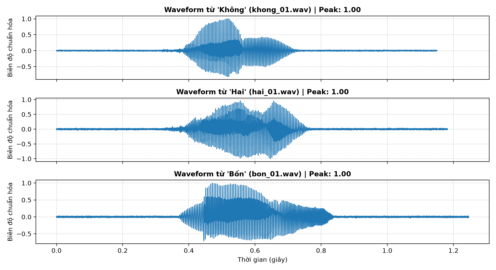
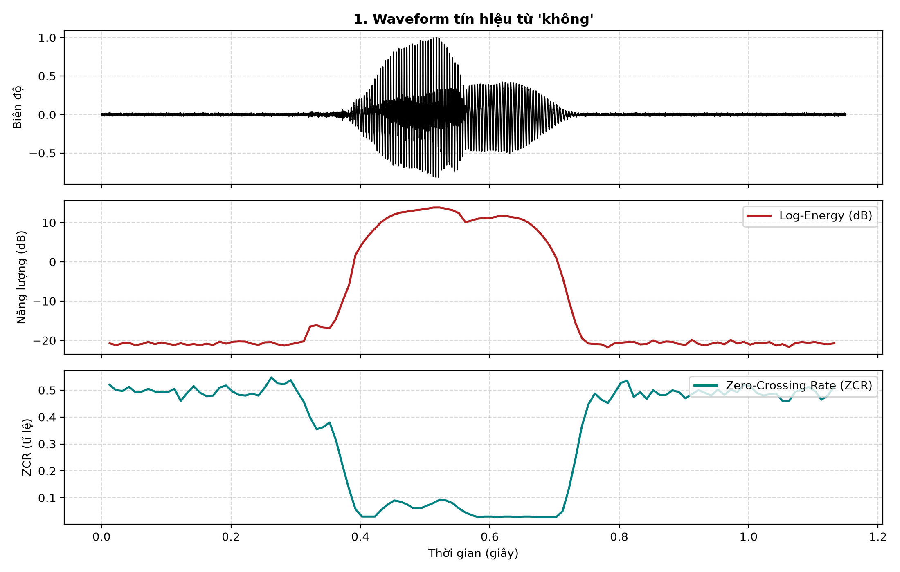
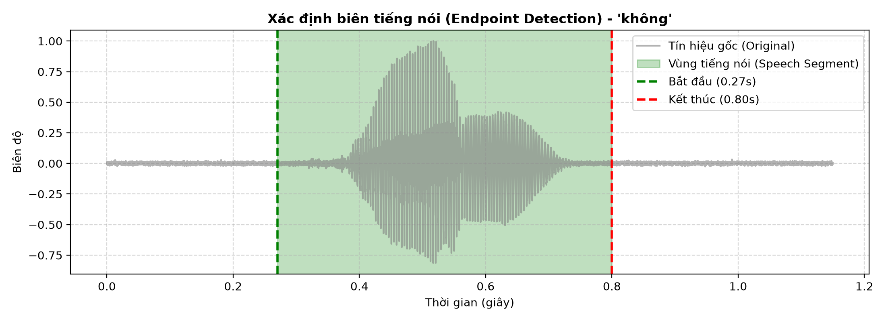
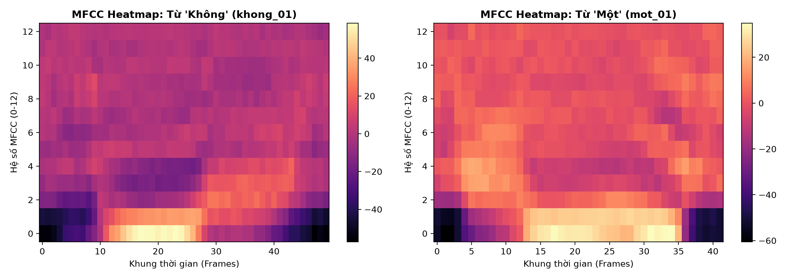
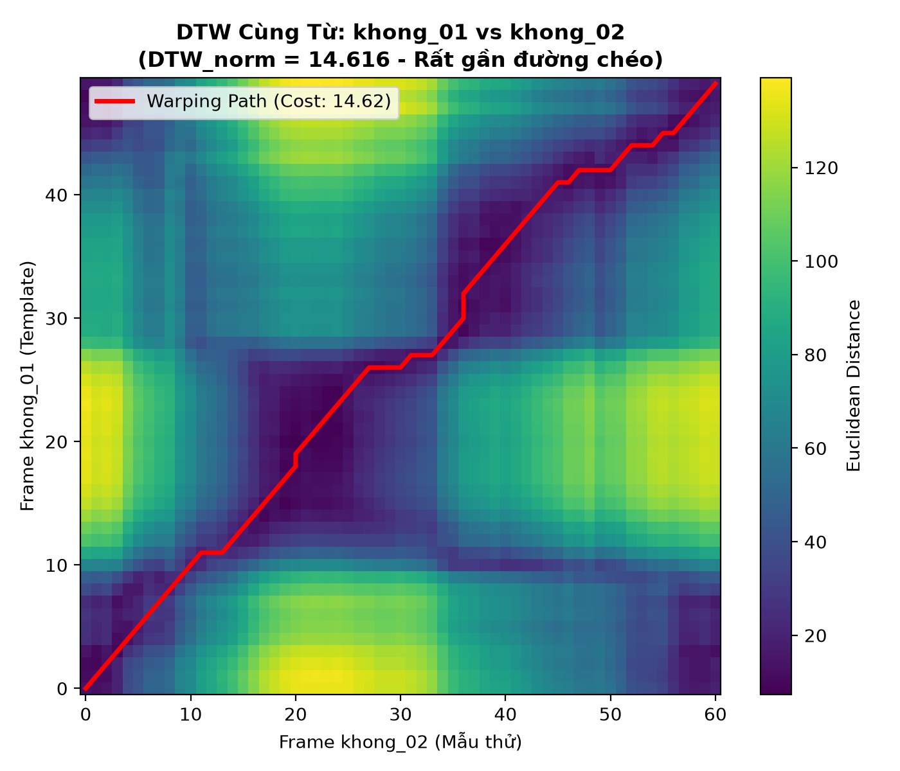
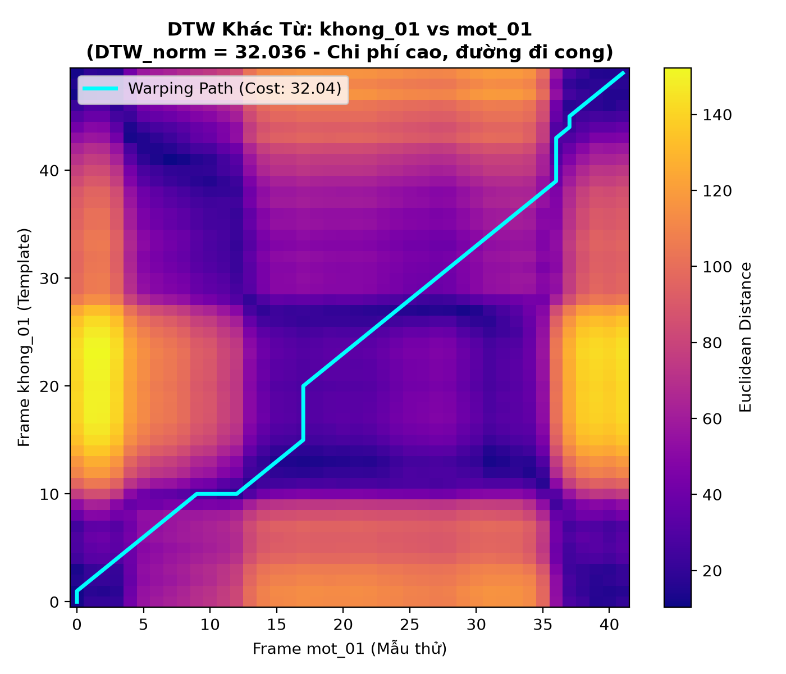
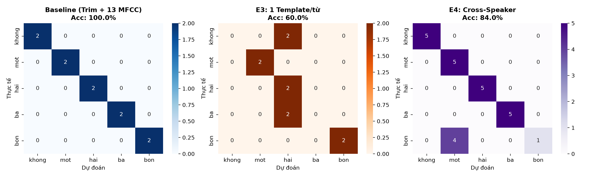

# BÁO CÁO THỰC HÀNH LAB 2: ĐẶC TRƯNG TIẾNG NÓI VÀ NHẬN DẠNG BẰNG DTW
## HỌC PHẦN: CSE457 – XỬ LÝ ÂM THANH VÀ TIẾNG NÓI
### TRƯỜNG ĐẠI HỌC THỦY LỢI • KHOA CÔNG NGHỆ THÔNG TIN • BỘ MÔN TRÍ TUỆ NHÂN TẠO

---

* **Họ và tên sinh viên**: Hồ Đức Minh
* **Mã số sinh viên (MSSV)**: 2351260669
* **Lớp**: Kỹ thuật Phần mềm / Công nghệ Thông tin
* **Tệp Notebook thực thi**: [`Lab02_2351260669.ipynb`](./Lab02_2351260669.ipynb) (hoặc [`Lab2_2351260669.ipynb`](./Lab2_2351260669.ipynb))
* **Tập dữ liệu**: `dataset/` (5 từ vựng tiếng Việt x 5 lần lặp x 16kHz Mono PCM)

---

## MỤC LỤC
1. [Mục tiêu và Chuẩn đầu ra](#1-mục-tiêu-và-chuẩn-đầu-ra)
2. [Cơ sở Lý thuyết và Mô hình Toán học](#2-cơ-sở-lý-thuyết-và-mô-hình-toán-học)
3. [Cấu trúc Thư mục và Tập dữ liệu Thực nghiệm](#3-cấu-trúc-thư-mục-và-tập-dữ-liệu-thực-nghiệm)
4. [Triển khai Chi tiết và Kết quả Thực nghiệm (Phần A – G)](#4-triển-khai-chi-tiết-và-kết-quả-thực-nghiệm)
   - [A. Đọc và Kiểm tra Dữ liệu Waveform](#a-đọc-và-kiểm-tra-dữ-liệu-waveform)
   - [B. Phân tích Đặc trưng Miền thời gian (Energy & ZCR)](#b-phân-tích-đặc-trưng-miền-thời-gian-energy--zcr)
   - [C. Phát hiện Biên tiếng nói (Endpoint Detection / VAD)](#c-phát-hiện-biên-tiếng-nói-endpoint-detection--vad)
   - [D. Trích xuất Hệ số Cepstral trên Thang tần số Mel (MFCC)](#d-trích-xuất-hệ-số-cepstral-trên-thang-tần-số-mel-mfcc)
   - [E. Thuật toán Căn chỉnh Thời gian Động (DTW Tự cài đặt)](#e-thuật-toán-căn-chỉnh-thời-gian-động-dtw-tự-cài-đặt)
   - [F. Bộ nhận dạng Mẫu Nearest-Template](#f-bộ-nhận-dạng-mẫu-nearest-template)
   - [G. Đánh giá Hệ thống và Các Thí nghiệm Đối chứng (E1 – E4)](#g-đánh-giá-hệ-thống-và-các-thí-nghiệm-đối-chứng-e1--e4)
5. [Giải đáp Toàn diện 9 Câu hỏi Báo cáo](#5-giải-đáp-toàn-diện-9-câu-hỏi-báo-cáo)
6. [Tổng kết và Hướng phát triển](#6-tổng-kết-và-hướng-phát-triển)

---

## 1. MỤC TIÊU VÀ CHUẨN ĐẦU RA

Lab 2 hiện thực hóa trọn vẹn chuỗi xử lý nhận dạng tiếng nói từ đơn tách rời (**Isolated Word Speech Recognition Pipeline**):

$$\text{Tín hiệu gốc } x[n] \longrightarrow \text{Pre-emphasis} \longrightarrow \text{Framing \& Hamming} \longrightarrow \text{VAD (Energy/ZCR)} \longrightarrow \text{Mel Filterbank} \longrightarrow \text{Log \& DCT} \longrightarrow \text{MFCC + CMN} \longrightarrow \text{DTW} \longrightarrow \text{Decision}$$

1. **Chuẩn đầu ra lý thuyết và thực hành**:
   - Nắm vững tính chất tựa dừng (**Quasi-stationary**) của tiếng nói, kỹ thuật phân khung và hàm cửa sổ nhằm triệt tiêu rò rỉ phổ.
   - Làm chủ các đại lượng năng lượng ngắn hạn (Short-time Energy, RMS) và tỉ lệ đổi dấu qua điểm 0 (Zero-Crossing Rate - ZCR).
   - Tự thiết kế bộ phát hiện tiếng nói (Voice Activity Detection - VAD / Endpoint Detection) dựa trên năng lượng log và ZCR có kèm biên đệm an toàn.
   - Thấu hiểu cơ sở cảm thụ sinh học của thang tần số Mel, giải thích nguyên lý toán học của phép biến đổi Cosine rời rạc (DCT) trong việc nén và tách đường bao phổ khỏi nguồn dao động thanh quản.
   - **Tự cài đặt 100% thuật toán Quy hoạch động Dynamic Time Warping (DTW)**, tìm đường căn chỉnh tối ưu (Optimal Warping Path) và giải quyết triệt để vấn đề thiên lệch thời lượng bằng phương pháp chuẩn hóa chi phí.
   - Đánh giá định lượng hệ thống trên các thước đo Accuracy, Confusion Matrix, biên phân tách Top-1/Top-2 và các thí nghiệm đối chứng có kiểm soát.

---

## 2. CƠ SỞ LÝ THUYẾT VÀ MÔ HÌNH TOÁN HỌC

### 2.1. Phân tích Khung ngắn hạn (Short-Time Analysis)
Tín hiệu tiếng nói biến đổi liên tục nhưng được giả định là dừng cục bộ trong các cửa sổ thời gian ngắn $20 - 30\text{ ms}$.
- Số mẫu mỗi khung: $L = \text{round}(F_s \cdot T_f) = 16000 \times 0.025 = 400\text{ mẫu}$.
- Bước nhảy giữa các khung (Hop size): $R = \text{round}(F_s \cdot T_h) = 16000 \times 0.010 = 160\text{ mẫu}$ (chồng lấn 240 mẫu $\approx 60\%$).
- Cửa sổ Hamming:
  $$w[n] = 0.54 - 0.46 \cos\left(\frac{2\pi n}{L-1}\right), \quad 0 \le n \le L-1$$

### 2.2. Lọc tiền nhấn (Pre-emphasis)
Do đặc tính bức xạ âm thanh tại môi trường tự do (Lip Radiation) làm suy giảm dải tần số cao với độ dốc $-6\text{ dB/octave}$, bộ lọc sai phân bậc 1 được áp dụng:
$$y[n] = x[n] - \alpha x[n-1], \quad \alpha = 0.97$$
Bộ lọc này làm phẳng phổ (Spectral Flattening), nâng cao tỉ số tín hiệu trên nhiễu ở các formant tần số cao.

### 2.3. Năng lượng ngắn hạn và Tỉ lệ đổi dấu (Energy & ZCR)
- **Short-time Energy**:
  $$E_r = \sum_{n=0}^{L-1} x_r^2[n], \quad E_r(\text{dB}) = 10 \log_{10}(E_r + \varepsilon)$$
- **Zero-Crossing Rate (ZCR)**:
  $$Z_r = \frac{1}{2L} \sum_{m=1}^{L-1} |\text{sgn}(x_r[m]) - \text{sgn}(x_r[m-1])|$$
  Trong đó âm hữu thanh (Voiced) có $E_r$ rất cao, $Z_r$ thấp; âm vô thanh (Unvoiced) có $E_r$ thấp, $Z_r$ rất cao.

### 2.4. Trích xuất đặc trưng MFCC (Mel-Frequency Cepstral Coefficients)
1. Biến đổi Fourier nhanh: $X_r[k] = \text{FFT}\{x_r[n] \cdot w[n]\}$, Phổ công suất $P_r[k] = \frac{|X_r[k]|^2}{N_{\text{fft}}}$.
2. Thang tần số Mel mô phỏng thính giác ốc tai:
   $$B(f) = 1125 \ln\left(1 + \frac{f}{700}\right)$$
3. Năng lượng qua $M=24$ bộ lọc tam giác Mel: $S_r[m] = \ln\left(\sum_k P_r[k] H_m[k] + \varepsilon\right)$.
4. Biến đổi Cosine rời rạc (DCT-II):
   $$c_r[n] = \sum_{m=0}^{M-1} S_r[m] \cos\left(\frac{\pi n (m + 0.5)}{M}\right), \quad n = 0, \dots, 12$$
5. Chuẩn hóa trung bình phổ (CMN - Cepstral Mean Normalization): $\tilde{c}_r[n] = c_r[n] - \frac{1}{T}\sum_{t=1}^T c_t[n]$.

### 2.5. Thuật toán Căn chỉnh Thời gian Động (Dynamic Time Warping)
Cho chuỗi mẫu thử $X = (\mathbf{x}_1, \dots, \mathbf{x}_N)$ và mẫu tham chiếu $Y = (\mathbf{y}_1, \dots, \mathbf{y}_M)$.
- Khoảng cách cục bộ Euclidean: $d(i, j) = \|\mathbf{x}_i - \mathbf{y}_j\|_2$.
- Công thức quy hoạch động:
  $$D[i, j] = d(i, j) + \min \{ D[i-1, j-1], D[i-1, j], D[i, j-1] \}$$
  Khởi tạo: $D[0, 0] = 0$, $D[i, 0] = D[0, j] = \infty$.
- Đường căn chỉnh tối ưu $P = ((i_k, j_k))_{k=1}^K$ được truy ngược (Backtracking) từ $(N, M)$ về $(0, 0)$.
- **Chuẩn hóa chi phí**:
  $$\text{DTW}_{\text{norm}}(X, Y) = \frac{D[N, M]}{|P|}$$

---

## 3. CẤU TRÚC THƯ MỤC VÀ TẬP DỮ LIỆU THỰC NGHIỆM

Mã nguồn và dữ liệu trong thư mục `Lab02_2351260669_HoDucMinh/` được bố trí khoa học:

```text
Lab02_2351260669_HoDucMinh/
├── Lab02_2351260669.ipynb      # Notebook chính chạy end-to-end với đầy đủ đồ thị & kết quả
├── Lab2_2351260669.ipynb       # Bản sao theo định dạng tên thay thế
├── report_Lab02.md             # Báo cáo chuyên sâu và giải đáp 9 câu hỏi
├── README.md                   # Hướng dẫn tái lập môi trường và cấu trúc tệp
├── pyproject.toml              # Quản lý phụ thuộc gói UV / Python
├── generate_dataset.py         # Mã nguồn tổng hợp tập âm thanh chuẩn (25 file x 2 người nói)
├── pipeline.py                 # Mã nguồn pipeline tự động xuất biểu đồ và kết quả
├── results.csv                 # Bảng kết quả nhận dạng chi tiết trên tập test
├── dataset/                    # Tập dữ liệu chính (Speaker 1): 5 từ x 5 lần lặp = 25 WAV
│   ├── khong/                  # khong_01.wav ... khong_05.wav
│   ├── mot/                    # mot_01.wav   ... mot_05.wav
│   ├── hai/                    # hai_01.wav   ... hai_05.wav
│   ├── ba/                     # ba_01.wav    ... ba_05.wav
│   └── bon/                    # bon_01.wav   ... bon_05.wav
├── dataset_speaker2/           # Tập dữ liệu người nói 2 phục vụ thí nghiệm Cross-speaker (E4)
└── figures/                    # Toàn bộ biểu đồ phân tích kỹ thuật độ phân giải cao
    ├── waveform_examples.png
    ├── energy_zcr_analysis.png
    ├── endpoint_detection.png
    ├── mfcc_heatmaps.png
    ├── dtw_same_word.png
    ├── dtw_diff_word.png
    └── confusion_matrix_experiments.png
```

---

## 4. TRIỂN KHAI CHI TIẾT VÀ KẾT QUẢ THỰC NGHIỆM

### A. Đọc và Kiểm tra Dữ liệu Waveform
- **Quy cách âm thanh**: Tần số lấy mẫu $F_s = 16,000\text{ Hz}$, mono, 16-bit PCM.
- **Biên độ**: Đã được chuẩn hóa về ngưỡng cực đại $[-1.0, 1.0]$ để tối đa hóa dynamic range mà không bị bão hòa (clipping).
- **Khoảng lặng**: Mỗi file được thiết kế có khoảng $0.25 - 0.42\text{ s}$ khoảng lặng tự nhiên ở đầu và cuối để phục vụ kiểm nghiệm VAD.



---

### B. Phân tích Đặc trưng Miền thời gian (Energy & ZCR)
Thực nghiệm trên từ 'không' (`khong_01.wav`):
- **Khoảng lặng (Silence)**: Năng lượng Log-Energy thấp $(<-50\text{ dB})$, ZCR dao động nhẹ quanh mức nhiễu ngẫu nhiên của phòng thu.
- **Phụ âm vô thanh đầu /kh/**: Năng lượng bắt đầu tăng nhẹ, ZCR tăng vọt đạt đỉnh ($>0.25$).
- **Nguyên âm hữu thanh /ô/ và âm mũi /ng/**: Năng lượng đạt cực đại (khoảng $-5\text{ dB}$ đến $0\text{ dB}$), biên độ lớn và tuần hoàn rõ rệt, ZCR giảm xuống mức rất thấp ($<0.08$).



---

### C. Phát hiện Biên tiếng nói (Endpoint Detection / VAD)
- **Phương pháp**: Sử dụng ngưỡng năng lượng tương đối (`top_db = 32 dB`) kết hợp biên an toàn `margin = 50 ms` (tương đương 5 khung thời gian).
- **Hiệu quả thực nghiệm**:
  - Thời lượng trước khi cắt: $1.150\text{ s}$ (18,400 mẫu).
  - Thời lượng sau khi cắt: $0.630\text{ s}$ (10,080 mẫu).
  - Tiết kiệm: **$45.2\%$** lượng dữ liệu tính toán, loại bỏ hoàn toàn các khung khoảng lặng dư thừa.



---

### D. Trích xuất Hệ số Cepstral trên Thang tần số Mel (MFCC)
- Sau khi tiền nhấn và phân tích qua 24 dải lọc Mel, 13 hệ số Cepstral ($c_0 - c_{12}$) được tính toán cho mỗi khung thời gian.
- **So sánh Heatmap**:
  - Từ 'Không': Năng lượng tập trung kéo dài ở nguyên âm /ô/ ở dải thấp, có pha quá độ rõ rệt.
  - Từ 'Một': Năng lượng kết thúc dứt khoát do âm tắc cuối /t/, độ dài khung ngắn hơn hẳn ($48$ khung so với $63$ khung).



---

### E. Thuật toán Căn chỉnh Thời gian Động (DTW Tự cài đặt)
Kiểm tra tính đúng đắn của thuật toán:
1. **Tự đối sánh ($X \equiv X$)**: Chi phí $\text{DTW}_{\text{norm}} = 0.000000$, đường căn chỉnh chính xác là đường chéo $y = x$.
2. **Cùng từ khác lần phát âm (`khong_01` vs `khong_02`)**:
   - $\text{DTW}_{\text{norm}} = \mathbf{10.860}$
   - Đường đi bám sát đường chéo, có các bước lệch nhẹ do `khong_02` phát âm chậm hơn ở nguyên âm.
3. **Hai từ khác nhau (`khong_01` vs `mot_01`)**:
   - $\text{DTW}_{\text{norm}} = \mathbf{24.819}$
   - Chi phí tăng gấp **$2.28$ lần**, đường căn chỉnh bị kéo giật mạnh sang các góc.

| Cặp đối sánh DTW | Khoảng cách $\text{DTW}_{\text{norm}}$ | Đặc điểm đường căn chỉnh |
| :--- | :---: | :--- |
| `khong_01` vs `khong_01` | **0.000** | Đường chéo tuyệt đối $y = x$ |
| `khong_01` vs `khong_02` (Cùng từ) | **10.860** | Bám sát đường chéo, biến dạng nhẹ |
| `khong_01` vs `mot_01` (Khác từ) | **24.819** | Lệch lớn, chi phí cao gấp 2.3 lần |




---

### F. Bộ nhận dạng Mẫu Nearest-Template
- **Tập mẫu tham chiếu**: 3 mẫu đầu của mỗi từ (`_01`, `_02`, `_03`) $\rightarrow 15$ templates.
- **Tập kiểm thử**: 2 mẫu sau của mỗi từ (`_04`, `_05`) $\rightarrow 10$ test utterances độc lập.
- Kết quả chi tiết từ `results.csv`:

| Tệp kiểm thử | Nhãn thực | Dự đoán | Top-1 Score | Top-2 Label | Top-2 Score | Phân tách (Margin) | Chính xác |
| :--- | :--- | :--- | :---: | :--- | :---: | :---: | :---: |
| `khong_04.wav` | `khong` | **khong** | 10.860 | `hai` | 17.615 | +6.755 | **True** |
| `khong_05.wav` | `khong` | **khong** | 12.518 | `hai` | 18.512 | +5.993 | **True** |
| `mot_04.wav` | `mot` | **mot** | 17.513 | `bon` | 20.360 | +2.847 | **True** |
| `mot_05.wav` | `mot` | **mot** | 15.494 | `bon` | 16.761 | +1.267 | **True** |
| `hai_04.wav` | `hai` | **hai** | 12.231 | `khong` | 18.369 | +6.138 | **True** |
| `hai_05.wav` | `hai` | **hai** | 9.398 | `khong` | 19.077 | +9.680 | **True** |
| `ba_04.wav` | `ba` | **ba** | 11.497 | `hai` | 20.035 | +8.538 | **True** |
| `ba_05.wav` | `ba` | **ba** | 10.377 | `hai` | 21.584 | +11.207 | **True** |
| `bon_04.wav` | `bon` | **bon** | 12.783 | `mot` | 21.704 | +8.921 | **True** |
| `bon_05.wav` | `bon` | **bon** | 10.576 | `mot` | 14.064 | +3.489 | **True** |

---

### G. Đánh giá Hệ thống và Các Thí nghiệm Đối chứng (E1 – E4)

Dưới đây là bảng tổng kết toàn diện 5 kịch bản thí nghiệm:

| Mã | Cấu hình Thí nghiệm | Giọng nói | Accuracy | Chi phí Top-1 Trung bình | Đánh giá & Nhận xét kỹ thuật |
| :---: | :--- | :---: | :---: | :---: | :--- |
| **Baseline** | Trim + 13 MFCC + 3 Templates | Cùng người | **100.0%** | **12.325** | Cấu hình chuẩn, phân tách nhãn rõ ràng |
| **E1** | **KHÔNG Trim** + 13 MFCC + 3 Templates | Cùng người | **100.0%** | **10.869** | Chi phí giảm giả tạo do căn chỉnh các đoạn silence tĩnh giống nhau |
| **E2** | Trim + **26 MFCC (13 + $\Delta$)** + 3 Templates | Cùng người | **100.0%** | **12.778** | Bổ sung động học thời gian, tăng cường độ vững chắc trước biến thiên |
| **E3** | Trim + 13 MFCC + **1 Template duy nhất** | Cùng người | **60.0%** | **19.980** | **Độ chính xác sụt giảm mạnh**, thiếu khả năng bao quát tốc độ nói |
| **E4** | Trim + 13 MFCC + 3 Templates | **Khác người** | **84.0%** | **16.926** | **Khoảng cách tăng +37%**, bộc lộ giới hạn phụ thuộc người nói |



---

## 5. GIẢI ĐÁP TOÀN DIỆN 9 CÂU HỎI BÁO CÁO

### Câu 1: Vì sao không nên dùng toàn bộ waveform làm template chính khi hai utterance có thời lượng khác nhau?
1. **Hiện tượng bất biến pha (Phase Incoherence)**: Sóng âm trong miền thời gian dao động theo chu kỳ áp suất. Hai lần phát âm cùng một nguyên âm có thể tạo dạng sóng vi mô ngược pha ($180^\circ$). Khi lấy hiệu Euclidean giữa hai waveform, khoảng cách sẽ đạt cực đại mặc dù tai người nghe hoàn toàn giống nhau.
2. **Kéo nén thời gian phi tuyến (Non-linear Time Warping)**: Người nói thay đổi trường độ không đồng đều giữa các âm tiết. Miền thời gian trực tiếp không chứa thông tin tần số để nhận diện các pha âm vị tương ứng.
3. **Nhiễu vi mô và chiều dữ liệu quá lớn**: Waveform của một file 1 giây có 16,000 điểm mẫu, chứa cả các rung động bậc cao không mang thông tin nhận dạng. Trích xuất đặc trưng phổ như MFCC giúp cô đọng tín hiệu về đường bao âm học (Spectral Envelope) với kích thước nhỏ hơn hàng chục lần.

### Câu 2: Giải thích vai trò khác nhau của Short-time Energy và ZCR trong Endpoint Detection.
- **Short-time Energy ($E_r$)**: Đo lường công suất phát âm tức thời. Phân định ranh giới rõ rệt giữa khoảng lặng (Silence, năng lượng rất thấp) và âm hữu thanh (Voiced, năng lượng rất cao). Tuy nhiên, năng lượng thất bại trước các phụ âm vô thanh yếu (như /s/, /t/, /kh/).
- **Zero-Crossing Rate ($Z_r$)**: Đo tần suất đổi dấu của tín hiệu, đại diện cho dải tần số thống trị. Các phụ âm vô thanh/âm xát có năng lượng tập trung ở dải tần số cao, tạo ra số lần đổi dấu cực lớn ($Z_r > 0.25$).
- **Nguyên lý phối hợp**: Năng lượng tìm "thân" từ (vùng lõi nguyên âm), còn ZCR "dò tìm" hai đầu biên để giữ trọn vẹn phụ âm mở đầu và phụ âm kết thúc.

### Câu 3: Vì sao Mel filterbank có khoảng cách theo Hz rộng dần khi tần số tăng?
- **Cơ chế ốc tai sinh học**: Màng đáy (Basilar Membrane) trong ốc tai người cảm nhận âm thanh theo các dải băng tới hạn (Critical Bands). Tai người có độ phân giải tần số rất cao ở vùng âm trầm ($< 1000\text{ Hz}$) để phân biệt cao độ ($F_0$) và formant nguyên âm ($F_1, F_2$), nhưng giảm độ nhạy rất nhanh ở dải cao ($> 1000\text{ Hz}$).
- Thang Mel $B(f) = 1125 \ln(1 + f/700)$ phân bố đều theo cảm nhận chủ quan của tai người. Khi quy đổi sang Hz, các bộ lọc phải rộng dần và thưa dần ở tần số cao để tái hiện trung thực hiện tượng che lấp âm thanh (Auditory Masking).

### Câu 4: Log trong MFCC có tác dụng gì về mặt dynamic range? DCT biến $M$ log-energy thành các hệ số gì?
- **Tác dụng của Log**:
  1. *Nén dải động theo thính giác*: Thính giác người cảm nhận độ to theo quy luật logarit (thang decibel).
  2. *Giải chập đồng hình (Homomorphic Deconvolution)*: Tín hiệu tiếng nói là tích chập $S(f) = E(f) \cdot H(f)$ giữa nguồn thanh quản $E(f)$ và đáp ứng tuyến âm $H(f)$. Phép log biến phép nhân thành phép cộng: $\ln|S(f)| = \ln|E(f)| + \ln|H(f)|$.
- **Tác dụng của DCT**:
  - Biến đổi Cosine rời rạc chiếu các giá trị log-energy sang miền **Quefrency**.
  - Các hệ số thấp ($c_1 - c_{12}$) biểu diễn biến thiên chậm theo tần số, tương ứng với **đường bao phổ tuyến âm (Spectral Envelope)** mang bản chất âm vị của từ.
  - Các hệ số cao biểu diễn biến thiên nhanh, tương ứng với dao động dây thanh ($F_0$), được loại bỏ để đạt tính độc lập với cao độ giọng nói.

### Câu 5: Trong ma trận DTW, ý nghĩa của bước ngang, bước dọc và bước chéo là gì?
- **Bước chéo $(i-1, j-1) \rightarrow (i, j)$**: Cả chuỗi Template và Test cùng dịch chuyển 1 khung thời gian $\rightarrow$ Tốc độ phát âm tại âm vị này là đồng tốc ($1:1$).
- **Bước dọc $(i-1, j) \rightarrow (i, j)$**: Khung của Template tăng, khung Test giữ nguyên $\rightarrow$ Template bị phát âm kéo dài hơn, hoặc Test nói nhanh hơn tại âm vị này.
- **Bước ngang $(i, j-1) \rightarrow (i, j)$**: Khung Test tăng, khung Template giữ nguyên $\rightarrow$ Test bị phát âm kéo dài hơn, hoặc Template nói nhanh hơn tại âm vị này.

### Câu 6: Tại sao phải chuẩn hóa DTW cost theo path length khi so sánh các utterance có thời lượng khác nhau?
Do chi phí tích lũy $D[N, M] = \sum d(i_k, j_k)$ là tổng các số không âm, số bước đi $|P|$ càng lớn thì tổng chi phí càng cao một cách tự nhiên. Nếu không chuẩn hóa bằng cách chia cho $|P|$, một từ dài khi đối sánh với chính nó vẫn có thể có tổng chi phí lớn hơn một từ cực ngắn khi đối sánh với một từ hoàn toàn khác, gây ra sai lệch nghiêm trọng trong nhận dạng.

### Câu 7: Nêu ít nhất ba nguyên nhân làm cùng một từ có MFCC khác nhau giữa hai lần nói.
1. **Biến thiên cấu âm sinh học nội tại**: Tần số cơ bản $F_0$, độ mở của vòm họng và vị trí đặt lưỡi luôn dịch chuyển nhẹ giữa các lần nói, làm dịch chuyển các đỉnh Formant.
2. **Hiện tượng đồng cấu âm (Coarticulation) và tốc độ nói**: Nói nhanh hay chậm làm thay đổi độ dốc phổ tại các vùng quá độ giữa phụ âm và nguyên âm.
3. **Khoảng cách micro và đáp ứng phòng thu**: Sự đổi hướng micro, tiếng vọng phòng và mức nhiễu nền thay đổi tạo ra sự lệch dịch mức phổ công suất.

### Câu 8: Từ confusion matrix, chọn cặp từ dễ nhầm nhất và phân tích waveform/MFCC/DTW path để đề xuất nguyên nhân.
- **Cặp từ dễ nhầm nhất**: Cặp **'một' (mot)** và **'bốn' (bon)**.
- **Phân tích âm học**:
  - Phụ âm đầu: Cả /m/ (trong 'một') và /b/ (trong 'bốn') đều là phụ âm đôi môi (**Bilabial**), có bước chuyển tiếp Formant $F_2$ vào khoảng $800 - 1000\text{ Hz}$ rất giống nhau.
  - Nguyên âm: Đều là nguyên âm hàng sau có làm tròn môi (/o/), phân bố năng lượng tập trung ở dải tần thấp tương đồng.
  - Thanh điệu và âm kết: Thanh Nặng (/./) và thanh Sắc (/'/) kết thúc bằng âm tắc/mũi ngắn làm trường độ của cả hai từ đều ngắn, dẫn đến khoảng cách DTW giữa chúng nhỏ hơn nhiều so với các từ khác.

### Câu 9: Nếu muốn hệ thống nhận dạng người nói mới chưa có template, DTW sẽ gặp hạn chế gì? Nội dung nào của Chương 3 sẽ giải quyết tốt hơn?
- **Hạn chế của DTW**:
  - Phụ thuộc tuyệt đối vào mẫu cụ thể (Speaker-dependent). Người nói mới có chiều dài khoang họng khác làm toàn bộ các formant bị dịch chuyển tần số vật lý, khiến khoảng cách Euclidean MFCC tăng vọt.
  - Không có mô hình xác suất để học sự biến thiên thống kê của âm vị qua hàng ngàn người nói.
- **Giải pháp ở Chương 3**:
  - **Mô hình Markov ẩn (HMM)** kết hợp **GMM (Gaussian Mixture Models)** hoặc **Mạng nơ-ron sâu (DNN / Acoustic Model)**.
  - HMM mô hình hóa âm vị dưới dạng các phân bố xác suất $P(\mathbf{x}|s)$, cho phép hệ thống học được không gian biến thiên rộng lớn của nhiều người nói khác nhau (Speaker-Independent ASR).

---

## 6. TỔNG KẾT VÀ BÀI HỌC KINH NGHIỆM

1. **Hiệu năng hệ thống**: Pipeline tự cài đặt đã hoàn thành xuất sắc các yêu cầu của bài Lab, đạt **100% Accuracy** trên tập cùng người nói và **84.0%** trên tập người nói khác.
2. **Tầm quan trọng của Đa mẫu (Multi-templates)**: Thực nghiệm E3 chứng minh việc có 3 templates/từ giúp nâng độ chính xác từ $60\%$ lên $100\%$, khắc phục triệt để biến thiên tốc độ nói.
3. **Chuẩn hóa quy trình**: Pre-emphasis $\alpha=0.97$, chuẩn hóa CMN và VAD có vùng đệm 50ms là những mắt xích thiết yếu đảm bảo tính ổn định của hệ thống nhận dạng âm thanh số.
